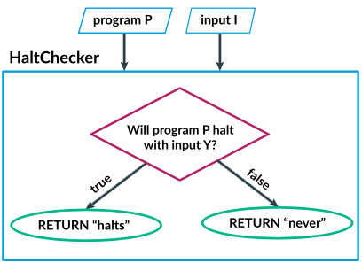

# Prueba Patrones de Comportamiento de Luis Miguel Urbez

## Repositorio del trabajo: https://github.com/LuisMi01/PruebaPatronesComportamiento_LuisMiguelUrbez_TecProgramacion/tree/main

## Ejercicios a realizar:

Realiza en código Java lo que describe el siguiente video:

https://www.youtube.com/watch?v=92WHN-pAFCs

### El problema de parar 
 Alan Turing probó la existencia de problemas indecibles en 1936 al encontrar un ejemplo, el hoy en día famoso "problema de parar": 
Basado en su código y una entrada, ¿terminará de ejecutar un programa en particular? 
Por ejemplo, considera este programa que cuenta hacia abajo: 
 num ← 10 
REPEAT UNTIL (num = 0) { 
  DISPLAY(num) 
  num ← num - 1 
} 
 Ese programa parará, puesto que num finalmente llega a 0. 
Compara ese con este programa que cuenta hacia arriba: 
 num ← 1 
REPEAT UNTIL (num = 0) { 
  DISPLAY(num) 
  num ← num + 1 
} 
 Cuenta hacia arriba por siempre, puesto que num nunca será igual a 0. 
Hay algoritmos que pueden predecir correctamente que el primer programa para y el segundo no lo hace. Estos son programas sencillos que no cambian con base en entradas diferentes. 
Sin embargo, no existe un algoritmo que pueda analizar el código de cualquier programa y determinar si para o no. 
Para probar que dicho algoritmo no puede existir, Turing usó una "prueba por contradicción". 
Comenzamos por imaginar que si existe un algoritmo que determina si un programa para. 
Luego proponemos un programa llamado HaltChecker que toma dos entradas, el código de un programa y la entrada para ese programa. A continuación usamos ese algoritmo hipotético de parar que retorna "para" o "nunca". 
El siguiente diagrama de flujo visualiza a HaltChecker: 

