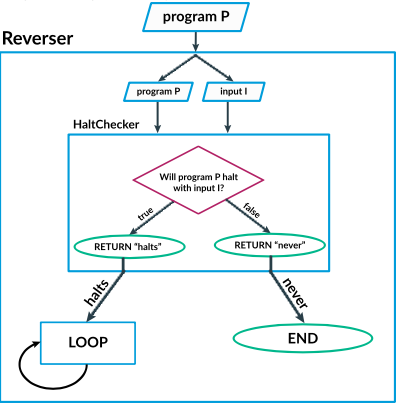
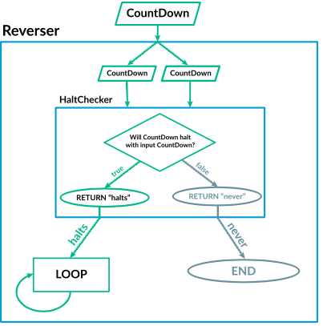
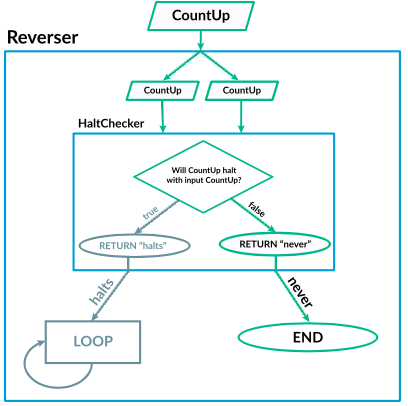
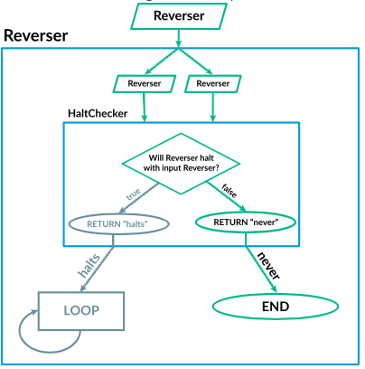
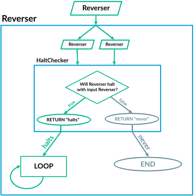

# Prueba Patrones de Comportamiento de Luis Miguel Urbez

## Repositorio del trabajo: https://github.com/LuisMi01/PruebaPatronesComportamiento_LuisMiguelUrbez_TecProgramacion/tree/main

### Posible estructuracion:
com.tuproyecto.programa
├── Programa
└── CodigoFuente

com.tuproyecto.teoremaparada
├── TeoremaParada
├── EstrategiaDetectarBucles
│   ├── EstrategiaSimple
│   ├── EstrategiaCompleja
│   └── EstrategiaHeuristica
├── ResultadoEjecucion
└── TipoResultadoEjecucion

com.tuproyecto.utilidades
├── LectorArchivos
└── AnalizadorSintaxis

com.tuproyecto.tests
├── TestTeoremaParada
├── TestEstrategiaDetectarBucles
└── TestUtilidades

## Ejercicios a realizar:

Realiza en código Java lo que describe el siguiente video:

https://www.youtube.com/watch?v=92WHN-pAFCs

### El problema de parar 
 Alan Turing probó la existencia de problemas indecibles en 1936 al encontrar un ejemplo, el hoy en día famoso "problema de parar": 
Basado en su código y una entrada, ¿terminará de ejecutar un programa en particular? 
Por ejemplo, considera este programa que cuenta hacia abajo: 
 num ← 10 
REPEAT UNTIL (num = 0) { 
  DISPLAY(num) 
  num ← num - 1 
} 
 Ese programa parará, puesto que num finalmente llega a 0. 
Compara ese con este programa que cuenta hacia arriba: 
 num ← 1 
REPEAT UNTIL (num = 0) { 
  DISPLAY(num) 
  num ← num + 1 
} 
 Cuenta hacia arriba por siempre, puesto que num nunca será igual a 0. 
Hay algoritmos que pueden predecir correctamente que el primer programa para y el segundo no lo hace. Estos son programas sencillos que no cambian con base en entradas diferentes. 
Sin embargo, no existe un algoritmo que pueda analizar el código de cualquier programa y determinar si para o no. 
Para probar que dicho algoritmo no puede existir, Turing usó una "prueba por contradicción". 
Comenzamos por imaginar que si existe un algoritmo que determina si un programa para. 
Luego proponemos un programa llamado HaltChecker que toma dos entradas, el código de un programa y la entrada para ese programa. A continuación usamos ese algoritmo hipotético de parar que retorna "para" o "nunca". 
El siguiente diagrama de flujo visualiza a HaltChecker: 

 Un diagrama del programa que comprueba paradas. Se muestra una caja con dos entradas, un programa P y una entrada I. Dentro de la caja hay un diagrama de flujo que comienza con una condición de diamante "¿Parará el programa P con entrada I?". Una flecha etiquetada verdadero lleva a "RETURN "para"" y una flecha etiquetada falso lleva a "RETURN "nunca"". 
Si le damos los programas anteriores como entrada a HaltChecker, veríamos que el programa de contar hacia abajo retorna "para" y el programa de contar hacia arriba retorna "nunca". Observa que no está realmente corriendo los programas, sino que examina su código y decide basado en su estructura. 
Pero ahora proponemos un programa llamado Reverser. Toma una sola entrada, el código de un programa. Le envía a HaltChecker ese programa como el programa a analizar y como la entrada a usar. HaltChecker entonces determina si el programa de entrada para cuando recibe a sí mismo como entrada. Si HaltChecker retorna "para", Reverser ejecuta un bucle infinito. Si HaltChecker retorna "nunca", Reverser inmediatamente retorna. 
 El siguiente diagrama de flujo visualiza a Reverser: 

 Un diagrama del programa Reverser. Muestra una caja externa con una sola entrada, el programa P. Dentro de la caja externa, la entrada fluye a dos entradas para el programa HaltChecker, el programa P y la entrada I. Estas fluyen a una caja interna con un diagrama de flujo.  Empieza con una condición de diamante "¿Parará el programa P con la entrada I?".  Una flecha etiquetada verdadero lleva a "RETURN "para"" y una flecha etiquetada falso lleva a "RETURN ""nunca"". La flecha etiquetada "para" fluye fuera de la caja desde el "RETURN "para"" hacia un node "LOOP" con una flecha que apunta de vuelta a si mismo. Otra flecha etiquetada "nunca" fluye fuera de la caja hacia "RETURN "nunca"" y llega al nodo "END". 
Si le damos el programa de contar hacia abajo como entrada a Reverser, entonces verá que HaltChecker retorna "para" y por tanto decide iterar indefinidamente. 

 Un diagrama del programa Reverser. Muestra una caja externa con una entrada, CountDown. Dentro de la caja externa, la entrada fluye a dos entradas para el programa HaltChecker. Estas entradas fluyen a una caja interna con un diagrama de flujo.  Empieza con una condición de diamante "¿Parará CountDown con entrada CountDown?".  Una flecha resaltada y etiquetada "verdadero" lleva a "RETURN "para"" y una flecha descolorida y etiquetada "falso" lleva a "RETURN ""nunca"".  Una flecha resaltada etiquetada "para" fluye fuera de la caja desde "RETURN "para"" hasta un nodo "LOOP" con una flecha que apunta de vuelta a sí mismo. Una flecha descolorida etiquetada "nunca" fluye fuera de la caja desde "RETURN "never"" hasta un nodo "END". 
Si le damos el programa de contar hacia arriba como entrada a Reverser, verá que HaltChecker retorna "nunca" y por tanto decide retornar inmediatamente. 

 Un diagrama del programa Reverser. Muestra una caja externa con una entrada, CountUp. Dentro de la caja externa, la entrada fluye a dos entradas para el programa HaltChecker.  Estas entradas fluyen a una caja interna con un diagrama de flujo. Empieza con una condición de diamante "¿Parará CountUp con entrada CountUp?".  Una flecha resaltada y etiquetada "verdadero" lleva a "RETURN "para"" y una flecha descolorida y etiquetada "falso" lleva a "RETURN ""nunca"".  Una flecha resaltada etiquetada "para" fluye fuera de la caja desde "RETURN "para"" hasta un nodo "LOOP" con una flecha que apunta de vuelta a sí mismo. Una flecha descolorida etiquetada "nunca" fluye fuera de la caja desde "RETURN "never"" hasta un nodo "END". 
 Reverser es verdaderamente un programa extraño. Se detiene cuando encuentra que otro programa no para, y le gusta seguir indefinidamente cuando encuentra que otro programa sí para. Esto es raro, pero está bien. en el mundo se permiten programas extraños. 
Pero aqui es donde todo se cae en pedazos: ¿qué pasa si le damos el mismo Reverser como entrada a Reverser? 
HaltChecker analiza el código de Reverser para determinar si se detiene o no. Si decide que no se detiene, entonces retorna "nunca". Reverser ve el resultado y retorna inmediatamente. 

 Un diagrama del programa Reverser. Muestra una caja externa con una entrada, Reverser. Dentro de la caja externa, la entrada fluye a dos entradas para el programa HaltChecker. Estas entradas fluyen a una caja interna con un diagrama de flujo.  Empieza con una condición de diamante "¿Parará Reverser con entrada Reverser?". Una flecha descolorida y etiquetada "verdadero" lleva a "RETURN "para"" y una flecha resaltada y etiquetada "falso" lleva a "RETURN ""nunca"".  Una flecha descolorida etiquetada "para" fluye fuera de la caja desde "RETURN "para"" hasta un nodo "LOOP" con una flecha que apunta de vuelta a sí mismo. Una flecha resaltada etiquetada "nunca" fluye fuera de la caja desde "RETURN "never"" hasta un nodo "END". 
Pero, ¡espera un segundo! HaltChecker acaba de afirmar que Reverser nunca para, y luego paró. HaltChecker no nos dió luna respuesta correcta. 
¿Qué pasa si en vez de esto HaltChecker retorna "para"? Cuando Reverserve el resultado, itera indefinidamente. 

 Un diagrama del programa Reverser. Muestra una caja externa con una entrada, Reverser.  Dentro de la caja externa, la entrada fluye a dos entradas para el programa HaltChecker. Estas entradas fluyen a una caja interna con un diagrama de flujo. Empieza con una condición de diamante "¿Parará Reverser con entrada Reverser?".  Una flecha resaltada y etiquetada "verdadero" lleva a "RETURN "para"" y una flecha descolorida y etiquetada "falso" lleva a "RETURN ""nunca"".  Una flecha resaltada etiquetada "para" fluye fuera de la caja desde "RETURN "para"" hasta un nodo "LOOP" con una flecha que apunta de vuelta a sí mismo. Una flecha descolorida etiquetada "nunca" fluye fuera de la caja desde "RETURN "never"" hasta un nodo "END". 
HaltChecker acaba de afirmar que Reverser para, y sin embargo, continúa corriendo indefinidamente. Una vez más, HaltChecker no nos dio la respuesta correcta. De hecho, no hay forma que HaltChecker nos dé la respuesta correcta en esta situación. 
 En consecuencia, hemos probado que nunca existirá un algoritmo perfectamente correcto para predecir paradas y que el problema de parar es indecidible. 

